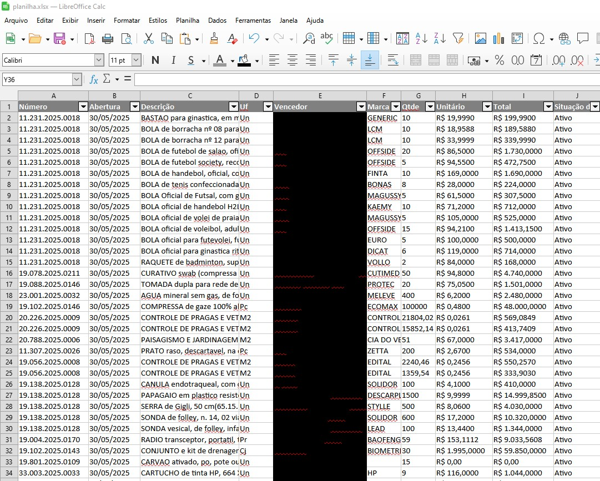

# Relatório de Dispensas Comprasnet Bahia

Este projeto contém um script Python (`script.py`) desenvolvido para automatizar a pesquisa e extração de dados de compras eletrônicas no site Comprasnet Bahia. O objetivo é coletar informações detalhadas sobre as dispensas de licitação e consolidá-las em uma planilha Excel para análise.

## O que o Script Faz

O `script.py` executa os seguintes passos de forma automatizada:

1.  **Navegação:** Inicia a navegação para a URL específica do Comprasnet Bahia.
2.  **Pesquisa Inicial:** Clica no botão de pesquisa (identificado pelo XPath `//*[@id="btnPesquisar"]`) para iniciar a busca por dispensas.
3.  **Coleta de Dados por Página:**
    * Aguarda o carregamento completo da página de resultados, que pode levar alguns minutos.
    * Após o carregamento, salva o código-fonte HTML da sessão atual em um arquivo na raiz do projeto.
    * Verifica a disponibilidade do botão "Próxima Página" (identificado pelo XPath `//*[@id="tblResultadoListaCount_next"]`). Enquanto o botão estiver disponível (não desabilitado), o script clica nele para avançar para a próxima página de resultados.
    * A cada nova página carregada, o código-fonte HTML é salvo em um novo arquivo.
4.  **Extração e Consolidação de Dados:**
    * Percorre cada arquivo `.html` salvo na raiz do projeto.
    * Para cada arquivo, identifica e extrai os seguintes dados:
        * `Descrição` (mapeado de 'Descrição' no HTML)
        * `Uf`
        * `Vencedor`
        * `Marca`
        * `Qtde`
        * `Unitário` (mapeado de 'Unitário R$' no HTML)
        * `Total` (mapeado de 'Total R$' no HTML)
    * Carrega esses dados e os adiciona a um arquivo `planilha.xlsx` existente, sem sobrescrever os dados já presentes.

## Estrutura da Planilha de Saída

O arquivo `planilha.xlsx` deve conter uma aba chamada `Sheet1` com as seguintes colunas de cabeçalho (precisamente nesta ordem e grafia):

* `Descrição`
* `Uf`
* `Vencedor`
* `Marca`
* `Qtde`
* `Unitário`
* `Total`

## Como Usar (Exemplo de Execução)

Para utilizar o script, você precisará ter o ambiente configurado com as dependências necessárias. Em seguida, execute o script:

```bash
python script.py

[](#)
